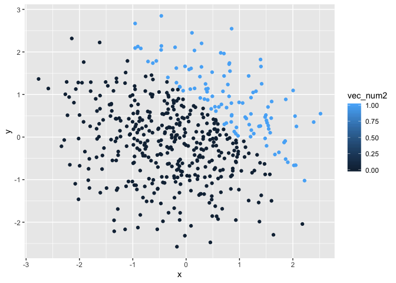
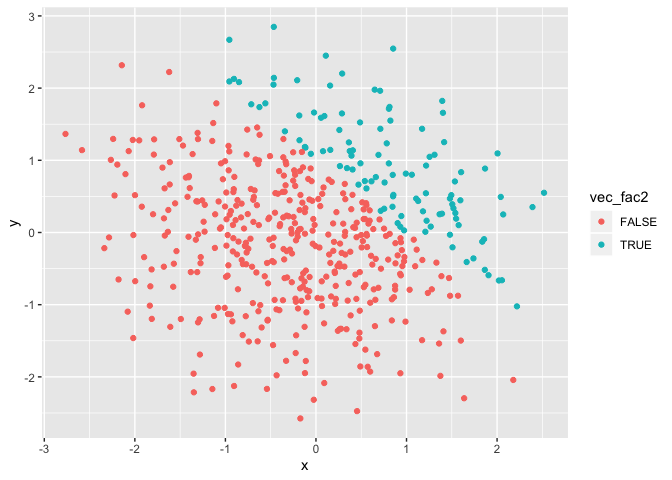

p8105\_hw1\_yw3438
================
Yuning Wang

# Problem 1

## First Code Chunk

Here’s the first code chunk for problem 1:

``` r
library(tidyverse)

problem1_df = tibble(
  ran_sample = rnorm(8),
  gr_th_0_logical = ran_sample > 0,
  vec_character = c("This", "is", "the", "answer", "of", "problem", "one", "here"),
  vec_factor = factor(c("white", "black", "black", "red", "white", "red", "black", "white"), levels = c("white", "black", "red") )
)

lapply(problem1_df, mean)
```

    ## Warning in mean.default(X[[i]], ...): argument is not numeric or logical:
    ## returning NA
    
    ## Warning in mean.default(X[[i]], ...): argument is not numeric or logical:
    ## returning NA

    ## $ran_sample
    ## [1] -0.2855568
    ## 
    ## $gr_th_0_logical
    ## [1] 0.125
    ## 
    ## $vec_character
    ## [1] NA
    ## 
    ## $vec_factor
    ## [1] NA

``` r
##The clss of vec_character is character and the class of vec_factor is fact.##
##The mean of vec_character and vec_factor cannot be calculated, because they are neither numerical nor logical vectors##
```

## Second Code Chunk

Here’s the second code chunk for problem
1:

``` r
##convert the logical vector to numeric, and multiply the random sample by the result##
gr_th_0_num = as.numeric(problem1_df$gr_th_0_logical)
prod(gr_th_0_num)
```

    ## [1] 0

``` r
##convert the logical vector to a factor, and multiply the random sample by the result##
gr_th_0_fac = as.factor(problem1_df$gr_th_0_logical)
#gr_th_0_fac_pro = prod(gr_th_0_fac)
#the random sample cannot be mutiplied as it's factor. I have to put it into a comment because the whole Rmd will break down if it's in the code.

##convert the logical vector to a factor and then convert the result to numeric, and multiply the random sample by the result##
gr_th_0_fac_num = as.numeric(as.factor(problem1_df$gr_th_0_logical))
prod(gr_th_0_fac_num)
```

    ## [1] 2

# Problem 2

``` r
problem2_df = tibble(
  x = rnorm(500),
  y = rnorm(500),
  vec_logic2 = x + y > 1,
  vec_num2 = as.numeric(vec_logic2),
  vec_fac2 = as.factor(vec_logic2)
)
```

The size of this dataset can be described by its columns and rows. The
number of the columns is 5 and the number of the rows of the dataset is
500.

The mean of x is 0.073077, the median of x is 0.0639718 and the standard
deviation of x is 1.0028832.

The proportion of cases for which x + y \> 1 is
0.248

## The Scatterplot of x and y

### Color points using logical variables

``` r
ggplot(problem2_df, aes(x = x, y = y)) + geom_point(aes(color = vec_logic2))
```

<!-- -->

### Color points using the numeric variables

``` r
ggplot(problem2_df, aes(x = x, y = y)) + geom_point(aes(color = vec_num2))
```

<!-- -->

### Color points using the factor variables

``` r
ggplot(problem2_df, aes(x = x, y = y)) + geom_point(aes(color = vec_fac2))
```

<!-- -->

``` r
##save the first plot##
logic_color_plot = ggplot(problem2_df, aes(x = x, y = y)) + geom_point(aes(color = vec_logic2))
ggsave("logic_color_plot.pdf", logic_color_plot, width = 8, height = 5)
```
